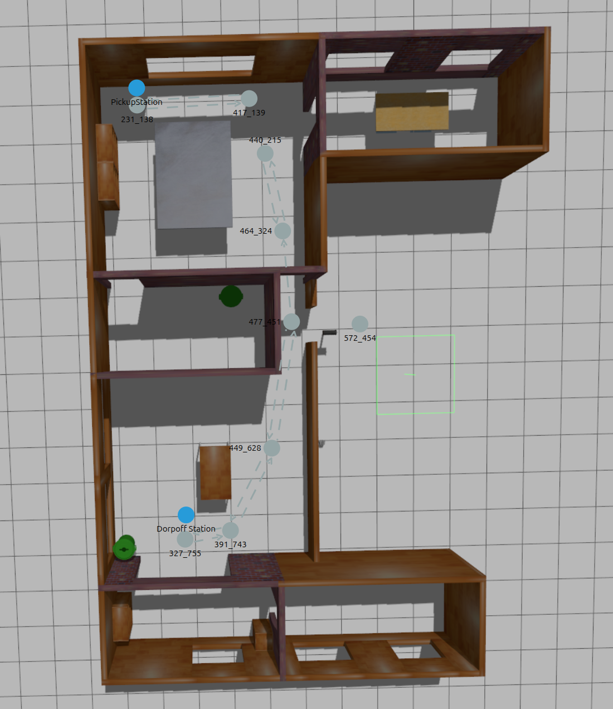

## Problem Statement: VDA5050 Master and Client for a Simulated AMR

Fleet Management Systems (FMS) increasingly talk to AGVs/AMRs from different vendors using
[VDA5050](https://github.com/VDA5050/VDA5050), a vendor-neutral communication interface
built on top of MQTT. Instead of every FMS needing a custom integration per robot vendor,
the robot exposes a standard `order`/`state` interface and the FMS (the **master control**)
just speaks VDA5050 to it (the **client**).

### Solution Stack
- TurtleBot3 (simulated in Gazebo, `turtlebot3_house` world) standing in for a real AMR
- MQTT broker for communication (e.g. Mosquitto)
- VDA5050 `order`/`state`/`connection` topics as the message interface

## Your Task

Build two standalone programs that talk to each other only via MQTT, using VDA5050 as the
message contract:

1. A **VDA5050 master**: stands in for the FMS/master control. It sends `order` messages and
   `instantAction`s to the client, and consumes `state`/`connection` messages to know what the
   robot is doing.
2. A **VDA5050 client**: the robot-side agent. It consumes `order`/`instantAction` messages
   from the master, drives a simulated TurtleBot3 to fulfill them, and publishes
   `state`/`connection` messages back.

You should be able to send an order from the master and watch the client carry it out end to
end, see **Task Steps** below for the concrete pickup/drop-off flow.

This doesn't need to be a ROS 2 package or follow any particular project layout, plain Python
scripts/modules are fine. The client's internals are up to you; ROS 2/Nav2 under the hood to
drive the TurtleBot3 is expected, but how you structure that code is your call.

### Task Steps

We evaluate on a rough bell curve, most candidates won't finish everything, and that's fine.
Work through it in this order and stop wherever your time runs out. A milestone that's solid
and demonstrably working is worth more than a rushed attempt at everything with nothing
working end to end.

1. **Get the TurtleBot3 House simulation running.** Launch the `TurtleBot3 House` world in
   Gazebo with Nav2, and confirm you can send it a manual nav goal (e.g. via RViz or a small
   test script) and watch it drive there. This proves your environment before you build
   anything VDA5050-specific on top of it (see **Optional Reading** below for setup docs).

2. **Create your own LIF map of your simulation world.** Use the
   [VDA5050 LIF Editor](https://github.com/bekirbostanci/vda5050_lif_editor) (a web tool for
   drawing nodes/edges on a floor plan and exporting them as a VDA5050 LIF file) to lay out
   the waypoints your order will reference, instead of hand-picking arbitrary coordinates.
   Include at least a `PickupStation` and a `DropoffStation` in the `stations` array, each
   referencing an `interactionNodeIds` node. Use
   [example_lif_file.json](./example_lif_file.json) as a format reference, not your actual map.

   

3. **Handcraft a VDA5050 `order` in JSON**, built from your own LIF map, covering these four
   phases: (1) GoTo `PickupStation`, (2) Pick up cart at `PickupStation`, (3) GoTo
   `DropoffStation`, (4) Drop off cart at `DropoffStation`. Then build the VDA5050 client so it
   can accept this order and carry it out: drive the TurtleBot3 through Nav2 node by node, and
   on a node with a `pick`/`drop` action, pause, mock it (wait a couple of seconds, log it),
   then continue. Publish `state` throughout.

4. **Build the VDA5050 master: send an order.** Publish your handcrafted order and confirm
   `state` shows `pick` finishing at the pickup node, then `drop` at the drop-off node.

5. **Add pause/resume** via `startPause`/`stopPause`. Pause mid-edge, confirm `state` reports
   `paused: true`, resume, confirm it continues to the drop-off node. If your route is too
   short to catch mid-flight, add more nodes in the LIF editor.

### Requirements
The system must:
- Have a LIF map of your simulation world (Task Step 2) with a `PickupStation` and a
  `DropoffStation` node
- Let the VDA5050 master send the four-phase pickup/drop-off `order` from Task Step 3, as a
  sequence of **nodes** (`x`/`y`/`theta`/`nodeId`) with a `pick` action on the `PickupStation`
  node and a `drop` action on the `DropoffStation` node, which the client executes in order
  (e.g. via Nav2's `NavigateToPose` for the GoTo phases)
- On reaching a node with a `pick`/`drop` action, the client pauses driving, executes a mocked
  pick/drop (e.g. wait a couple of seconds and log it, no real gripper/load handling needed),
  reports it via `actionStates` in `state`, then continues
- Have the VDA5050 client publish `state` periodically. See the **State Requirement** below
- Have the VDA5050 master be able to send `instantAction`s to at least:
  - `startPause`: the client pauses execution (e.g. cancels the in-flight Nav2 goal without
    discarding the order, so it can resume from where it left off)
  - `stopPause`: the client resumes the paused order from where it left off
  and reflect the pause/resume via the `paused` field in `state`
- Have the VDA5050 client publish a `connection` topic (`ONLINE`/`OFFLINE`), reflecting its
  liveness (e.g. via MQTT last will)

### State Requirement

The VDA5050 client should periodically publish a `state` message containing enough
information for the master to understand what the robot is doing.

At minimum, include:

- `orderId`: current order being executed
- `lastNodeId`: last waypoint successfully reached
- `agvPosition`: current `x`, `y`, `theta`
- `driving`: whether the robot is currently moving
- `paused`: whether execution is paused
- `batteryState`: may be mocked
- `errors`: report navigation failures or aborted goals
- `actionStates`: status of the current `pick`/`drop` action, if any (e.g. `RUNNING` while
  executing, `FINISHED` once done), keyed by `actionId`

For example:

```json
{
  "orderId": "order-001",
  "lastNodeId": "node-1",
  "agvPosition": {
    "x": 1.2,
    "y": 2.4,
    "theta": 0.0
  },
  "driving": true,
  "paused": false,
  "batteryState": {
    "batteryCharge": 85
  },
  "errors": [],
  "actionStates": [
    {
      "actionId": "pick-1",
      "actionType": "pick",
      "actionStatus": "FINISHED"
    }
  ]
}
```

## Other Comments

The submission must include a proper README.md or quick start guide.

The README should clearly explain:

1. How to install dependencies (ROS 2, Gazebo, TurtleBot3 packages, Nav2, an MQTT broker)
2. How to launch the TurtleBot3 House simulation with Nav2
3. How to run the MQTT broker, the VDA5050 client, and the VDA5050 master
4. How to test it, e.g. using the VDA5050 master to send a sample `order` and observing the
   robot navigate in Gazebo while `state` messages update over MQTT

### Architecture and Sequence Diagrams

Diagrams matter here: VDA5050 is a message-driven protocol spanning two processes and MQTT,
and prose alone leaves the reader guessing at the actual flow. Include:

- An **architecture diagram** showing the master, the client, the MQTT broker/topics between
  them, and how the client connects into ROS 2/Nav2/the TurtleBot3 simulation.
- A **sequence diagram** walking through a full pickup/drop-off order lifecycle end to end:
  master publishes `order`, client drives to the pickup node, executes the `pick` action and
  reports it via `actionStates`, drives to the drop-off node, executes `drop`, order completes,
  final `state` reflects it. Show the MQTT topic each message travels over.
- A second **sequence diagram** (or an extension of the first) for the pause/resume case:
  master sends `startPause` mid-order, client halts the in-progress Nav2 goal and publishes
  `state` with `paused: true`, master sends `stopPause`, client resumes toward the same node
  and publishes `paused: false`.

Hand-drawn/photographed, ASCII, or any diagramming tool you like is fine. Clarity matters
more than polish.

### What We Want To See

We want to see how you:

1. Break down an integration problem spanning a protocol spec (VDA5050), MQTT, and ROS 2/Nav2
2. Structure a clean two-sided system (master and client) around a shared message contract
3. Use Git
4. Write clean Python code
5. Work with MQTT and map a real-ish spec onto working message handling
6. Work with the ROS 2 navigation stack (Nav2) and a simulated robot (TurtleBot3/Gazebo)
7. Communicate the message flow clearly through architecture and sequence diagrams, not just
   prose
8. Explain your work clearly in a README, including trade-offs and any parts of the VDA5050
   spec you chose to simplify or skip

You don't need to implement the full VDA5050 spec, see **Spec Scope for This Assignment**
below for what's in and out. Note any simplifications you make and why.

A copy of the PDF is included alongside this file:
[VDA5050-V2p1p0-2024-05.pdf](./VDA5050-V2p1p0-2024-05.pdf)

### Spec Scope for This Assignment

The full spec (linked below) covers a lot more than this assignment needs. Section numbers
refer to `VDA5050_EN.md` / the PDF, chapter 6 "Protocol specification":

**In scope** (read these):
- 6.3 MQTT topic levels: how topic names are structured
- 6.4 Protocol header: `headerId`, `timestamp`, `version`, `manufacturer`, `serialNumber` on
  every message
- 6.5 Topics for communication: the `order`, `instantActions`, `state`, `connection` topics
- 6.6.1 Concept and logic (order as a list of nodes/edges), but simplified: treat every order
  as fully released with no horizon, see below
- 6.8.1 / 6.8.2, `startPause`/`stopPause`/`pick`/`drop` rows only: what these actions do and
  their linked state (`paused`, `.load`)
- 6.9 Topic "instantActions"
- 6.10.1 Concept and Logic, 6.10.2 Traversal of nodes and entering/leaving edges, triggering
  of actions (only as it applies to `pick`/`drop` on a node), 6.10.6 Implementation of the
  state message (only the fields listed in the **State Requirement** above)
- 6.11 Action states, for `paused`, `pick`, and `drop`
- 6.14 Topic "connection"

**Out of scope** (skip these, they add real complexity that isn't the point of this
exercise):
- 6.6.2 Orders and order update: base/horizon splitting and `orderUpdateId` stitching for
  incrementally extending an in-flight order. Handle one full order at a time instead
  (reject or replace, no incremental updates).
- 6.6.3 Order Cancellation (`cancelOrder`): not required per the Requirements above
- 6.7 Maps: map upload/enable/delete handling
- 6.8 Actions, everything except `startPause`/`stopPause`/`pick`/`drop`: `initPosition`,
  `startCharging`/`stopCharging`, `detectObject`, `finePositioning`, `waitForTrigger`,
  `factsheetRequest`, map actions, etc. Edge actions, `lhd`/multi-load-handling-device
  parameters, and real gripper/load handling are also out of scope: mock the pick/drop with a
  short wait
- 6.10.3 Base request (`newBaseRequest`): tied to the base/horizon mechanism above
- 6.10.4 Information (`info` array): optional, debugging/visualization only
- 6.12 Action blocking types and sequence (NONE/SOFT/HARD): only matters with multiple
  concurrent node/edge actions
- 6.13 Topic "visualization": optional per the spec itself
- 6.15 Topic "factsheet": vendor capability descriptor, not needed for a single simulated
  robot you already know the capabilities of

### Optional Reading (not required)

- [VDA5050 v2.1.0 spec](https://github.com/VDA5050/VDA5050/tree/2.1.0): full spec
  (`VDA5050_EN.md`) and JSON schemas (`json_schemas/`) for `order`, `state`,
  `instantActions`, `connection`, and `visualization`. Use this version, not the `main`
  branch, which may have moved on to a newer release since this assignment was written.
- [TurtleBot3 simulation docs](https://docs.robotis.com/docs/systems/turtlebot3/simulation/gazebo_simulation)

### How to Submit
1. Clone the repo
2. Complete the assignment
3. Push to your own GitHub repo
4. Share the repo link
